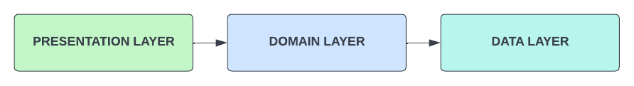
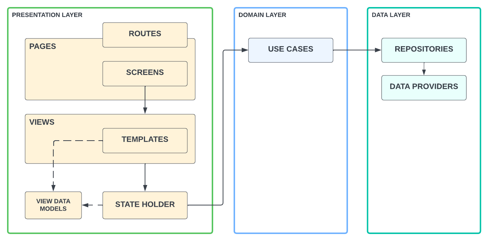
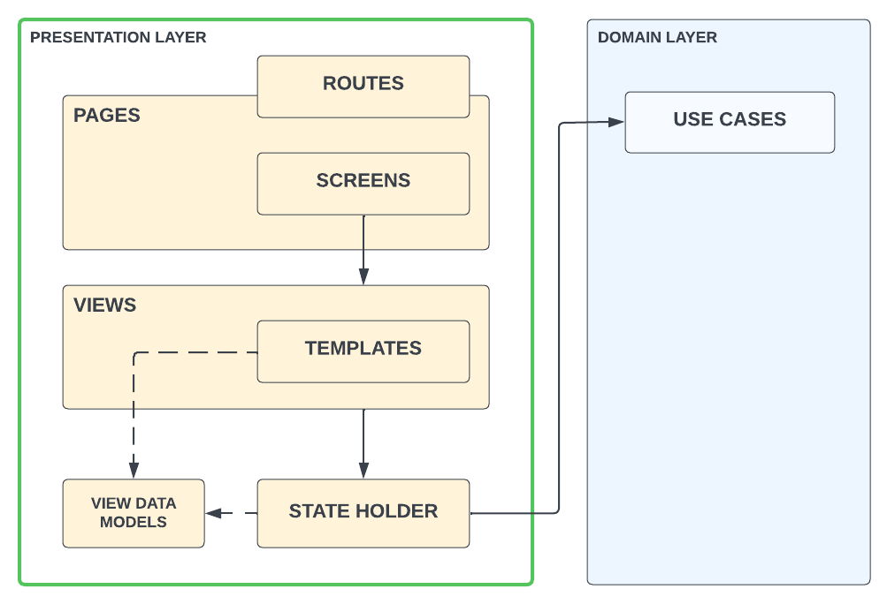

# Architecture Components

The following architecture components were built based on a three-tier layered architecture:

<p align="center">
  
</p>

- The **Presentation Layer** displays application data on the screen to our users.
- The **Domain Layer** contains the all the business logic our the application.
- The **Data Layer** exposes application data.

### Quick Notes Legend

These are the note types you might find in this document:

- 🚨 : Important notes about design opinions.
- 🔮 : Future enhancements to the repository.

## Architecture Layers Overview

These are the main architecture components:

<p align="center">
  
</p>

### Presentation Components
- [Pages](#pages)
  - [Routes](#routes)
  - [Screens](#screens)
- [Views](#views)
  - [View Templates](#view-templates)
- [State Holders](#state-holders)
- [View Data Models](#view-data-models)

### Domain Components
- [Use Cases](#use-cases)
- [Entities (TBD)](#entities-tbd)

### Data Components
- [Repositories (TBD)](#repositories-tbd)
- [Data Providers (TBD)](#data-providers-tbd)
- [Models (TBD)](#models-tbd)
    
## Presentation Layer

<p align="center">
  
</p>

### Pages

A `Page` is defined as the association of a `Screen` to a `Route`. Given a `Route` the page has the responsibility to decide which `Screen` is associated to this `Route`.

If we were look at the pages in a YAML format we would have the follwing:
```yaml
home_page:
  route: 
    HomeScreen.routeName
  widget: 
    HomeScreen()
merchant_detail_page:
  route: 
    MerchantDetailScreen.routeName
  widget: 
    MerchantDetailScreen()
```

### Routes

A `Route` is the full path of the `Page`, this MUST be a **String** constant.

Examples:
```dart
'/'
'/merchants'
'/merchants/:merchantId'
'/user/settings'
'/user/personal-info'
```

### Screens

A `Screen` is the collection of `View` components. Simple screens could contain only one view.
  
> 🚨 For now, a `Screen` is almost the same as a `View`. Regardless the `Screen` could be used as the entry point to injected feature toggles.

> 🔮 We might need to move the feature toggle injection point to the `View`. As the `Screen` component could be a collection of `View` components, these `View` components could be imported from other teams feature modules.

### Views

A `View` is the glue for a `ViewTemplate` with its `State Holder`.

- The `View` is responsible for reading attributes from the `StateHolder` and propagating them to the `ViewTemplate`.
- The `View` overrides `ViewTemplate` callbacks to delegate business logic execution requests to its `StateHolder`.  

### View Templates

A `ViewTemplate` defines the `Screen` skeleton, it's a dump component exposing callbacks and customization attributes.  


### State Holders

A `StateHolder` is responsible to process application logic. 

> 🚨  This is the only `Presentation` component allowed to communicate with `Domain` components.
> 🚨  State should be a projection of the data from a single source of truth. The Data Access Layer MUST be the source of truth.

- A `StateHolder`...
- Is a state projection component which listens to Data Access Streams. 
- Could filter or transform the data in terms of `ViewDataModel` information.  
- Runs `UseCases` and updates local state if needed.  


### View Data Models

A `ViewDataModel` is the most atomic Data scope for a view. In other words, partial views of `Domain Entities`.

> 🚨 For now, this component could be considered as optional.


## Domain Layer

### Use Cases

A `UseCase` encapsulates business logic execution.

> 🚨  This is the only `Architecture` component allowed to communicate with `Data` components.

A `UseCase`...
- Could call other `UseCases` and use the call result to continue the use case flow.
- Could call multiple `Repositiries` to get all the data it needs to operate.

### Entities (TBD)

TODO: Add docs

## Data Layer

- TODO: Add docs for Repositories adding a Stream
- TODO: Add docs for having different data providers, local, in-memory, remote, etc.
- TODO: Document ideas on how to have queues, schedulers and batched requests (Data sources example)

### Repositories (TBD)

TODO: Add docs

### Data Providers (TBD)

TODO: Add docs

### Models (TBD)

TODO: Add docs

## WIP: Architecture Principles

For now, this sections contains general ideas on how to state the principles this repository is following:
- These UI-based classes should only contain logic that handles UI and operating system interactions. 
  - By keeping these classes as lean as possible, you can avoid many problems related to the component lifecycle, and improve the testability of these classes.
- You should drive your UI from data models, preferably persistent models.
- If you base your app architecture on data model classes, you make your app more testable and robust.